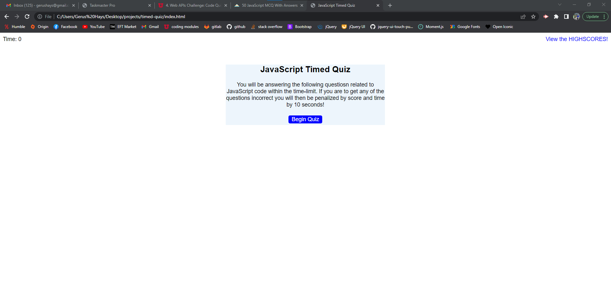

# Javascript timed Quiz
## Purpose
The purpose of this webpage is to create a timed quiz and whenever the user gets a wrong answer it will deduct 10 seconds from the time limit.  
Users have the option to select the length of their password and whether or not to include: Uppercase or Lowercase letters, numbers and special characters.  
If the user inputs a number less than 8 or greater than 128 it will do nothing and they will have to click the generate button once more to select a number between the given length.  
Once the user selects a length they will have 4 windows populate to confirm what characters they would like to include in their password. 
If they confirm all 4 windows their password will include all 4 types of characters.  
However, if they confirm 2 and cancel 2 the password will only include what characters they have confirmed that will populate in the text box.  

## Built With
* HTML
* CSS
* JS

## Moving Forward
- I would like to add more functionality to the quiz to play sounds when the user gets a question right or wrong. Which is currently in the code just commented out for now.

## Lessons Learned
I learned a lot throughout this project
- I utilized all of my resources doing this from scratch. To include my friends that are in the field now, my tutor / TA and a whole lot of google.
- I learned a lot of advanced Javascript to make this work the way not only I wanted it to work but also how the cohort wanted this to function. 

### Web link:
- My [website](https://gerushays.github.io/timed-quiz/)

## Screenshot

## Contribution
Made with ❤️ by Gerus Hays